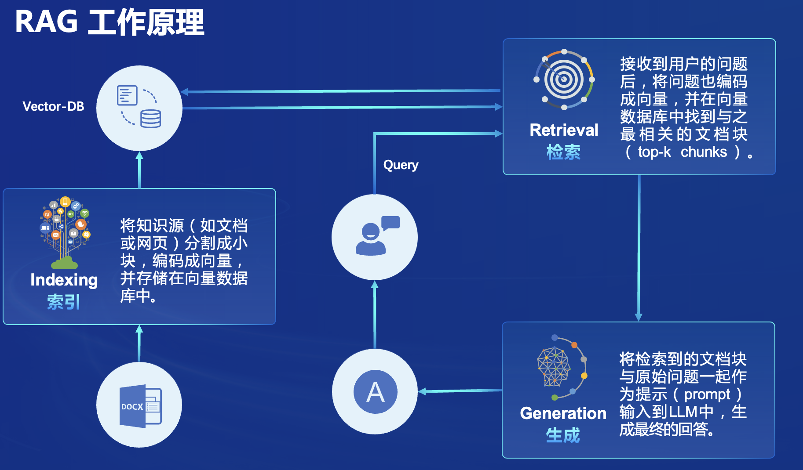
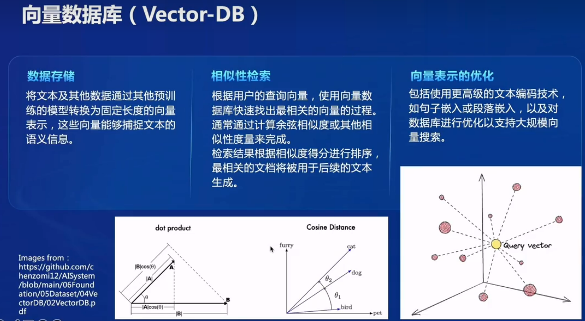
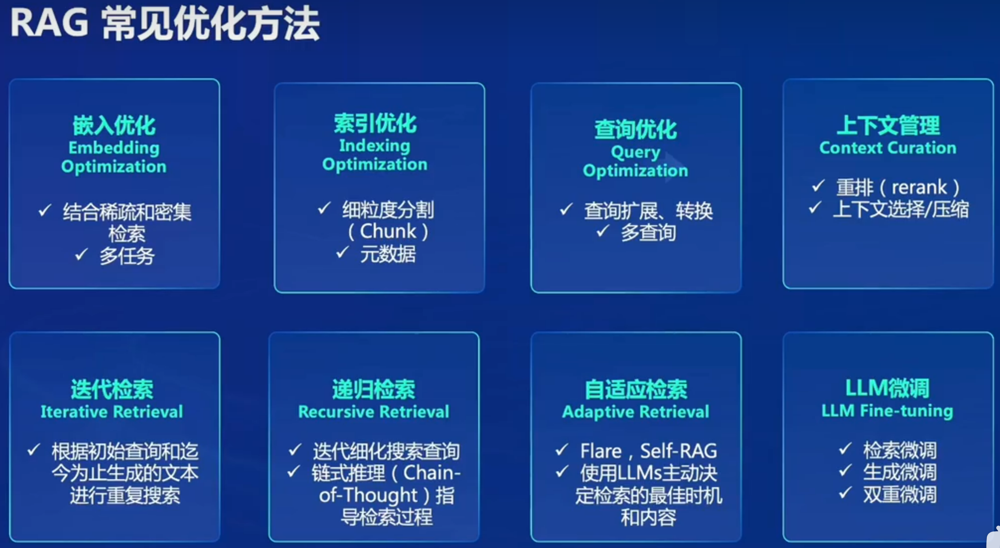
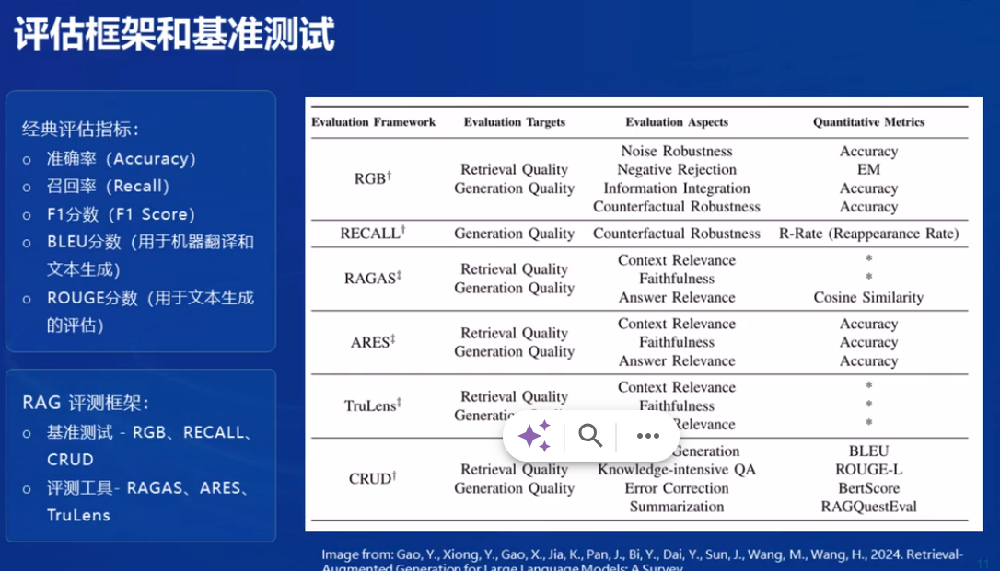
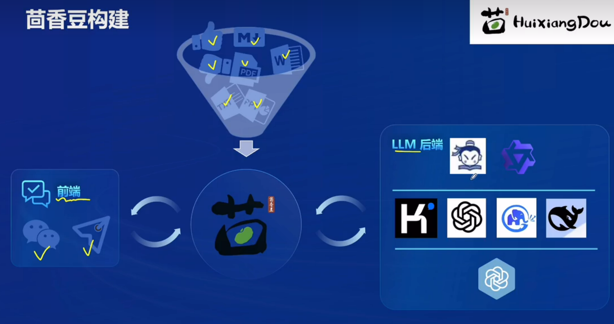

# InternLM2-Tutorial-Assignment-Lecture3   

# Lecture3    
# 第3课 【茴香豆：搭建你的 RAG 智能助理】   
[第3课视频](https://www.bilibili.com/video/BV1QA4m1F7t4/)   
[第3课文档](https://github.com/InternLM/Tutorial/blob/camp2/huixiangdou/readme.md)  
2024.4.6  书生·浦语社区贡献者【北辰】   

## 第3课 笔记   

### RAG概述   
RAG（Retrieval Augmented Generation）技术，通过检索与用户输入相关的信息片段，并结合外部知识库来生成更准确、更丰富的回答。解决 LLMs 在处理知识密集型任务时可能遇到的挑战, 如幻觉、知识过时和缺乏透明、可追溯的推理过程等。提供更准确的回答、降低推理成本、实现外部记忆。    

RAG 能够让基础模型实现非参数知识更新，无需训练就可以掌握新领域的知识。本次课程选用的茴香豆应用，就应用了 RAG 技术，可以快速、高效的搭建自己的知识领域助手。       

RAG发展进程:    
RAG概念最早是由Meta(facebook)的Lewis等人在2020《Retrieval-Augmented Generation for Knowledge-Intensive NLP Tasks》中提出的。    

#### RAG工作原理
三个重要组成部分：索引 检索 生成  
     

**向量数据库(Vector-DB)**   
向量数据据需要被优化，对于向量表示的优化，例如使用更高级的文本编码技术。    
     
**对向量表示的优化将直接影响RAG结果的好坏**  

#### RAG常见的优化方法：    
- 嵌入优化 索引优化 查询优化 上下文管理
- 迭代检索 递归检索 自适应检索
- LLM微调
  

LLM模型优化方法比较：提示工程词 微调  RAG    
  

#### **RAG技术应用**：    
- 问答系统
- 文本生成    
- 信息检索    
- 图片描述   

#### 评估框架和基准测试    
   
     
### 茴香豆    
- 茴香豆是一个基于LLMs的领域知识助手，应用场景智能客户；    
- 核心特性：开源免费，遵循BSD-3-Clause的开源协议，高效准确，领域知识， 部署成本低，安全（本地部署，信息不上传 保护数据和用户隐私），扩展性强（支持及时交流软件如微信飞书）。    
- 茴香豆构建：知识库（markdown PPT word PDF)， 前端（微信 飞书 discoard）， LLM后端（书生·浦语 通义千问 Kimi ChatGPT），豆哥。
  
    

## 第3课 作业  
### 基础作业 - 完成下面两个作业

#### 1. 在[茴香豆 Web 版](https://openxlab.org.cn/apps/detail/tpoisonooo/huixiangdou-web)中创建自己领域的知识问答助手

- 参考视频[零编程玩转大模型，学习茴香豆部署群聊助手](https://www.bilibili.com/video/BV1S2421N7mn)
- 完成不少于 400 字的笔记 + 线上茴香豆助手对话截图(不少于5轮)
- （可选）参考 [代码](https://github.com/InternLM/HuixiangDou/tree/main/web) 在自己的服务器部署茴香豆 Web 版

#### 2.在 `InternLM Studio` 上部署茴香豆技术助手

- 根据教程文档搭建 `茴香豆技术助手`，针对问题"茴香豆怎么部署到微信群？"进行提问
- 完成不少于 400 字的笔记 + 截图

### 进阶作业 - 二选一 

#### A.【应用方向】 结合自己擅长的领域知识（游戏、法律、电子等）、专业背景，搭建个人工作助手或者垂直领域问答助手，参考茴香豆官方文档，部署到下列任一平台。
  - 飞书、微信
  - 可以使用 茴香豆 Web 版 或 InternLM Studio 云端服务器部署
  - 涵盖部署全过程的作业报告和个人助手问答截图

#### B.【算法方向】尝试修改 `good_questions.json`、调试 prompt 或应用其他 NLP 技术，如其他 chunk 方法，提高个人工作助手的表现。
  - 完成不少于 400 字的笔记 ，记录自己的尝试和调试思路，涵盖全过程和改进效果截图

### 大作业项目选题

#### A.【工程方向】 参与贡献茴香豆前端，将茴香豆助手部署到下列平台
  - Github issue、Discord、钉钉、X
#### B.【应用方向】 茴香豆RAG-Agent
  - 应用茴香豆建立一个 ROS2 的机器人Agent
#### C.【算法方向】 茴香豆多模态
  - 参与茴香豆多模态的工作
 

