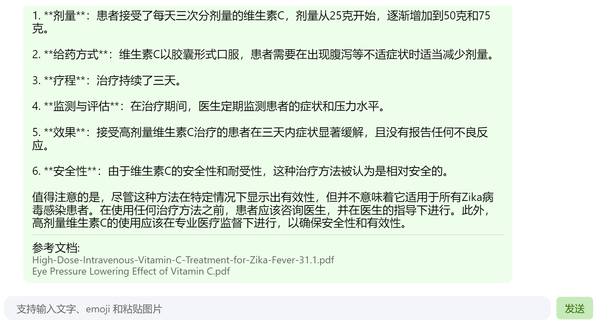

# InternLM2-Tutorial-Assignment-Lecture3   

# Lecture3    
# 第3课 【茴香豆：搭建你的 RAG 智能助理】   
[第3课视频](https://www.bilibili.com/video/BV1QA4m1F7t4/)   
[第3课文档](https://github.com/InternLM/Tutorial/blob/camp2/huixiangdou/readme.md)  
2024.4.6  书生·浦语社区贡献者【北辰】   

## 第3课 笔记   

### RAG概述   
RAG（Retrieval Augmented Generation）技术，通过检索与用户输入相关的信息片段，并结合外部知识库来生成更准确、更丰富的回答。解决 LLMs 在处理知识密集型任务时可能遇到的挑战, 如幻觉、知识过时和缺乏透明、可追溯的推理过程等。提供更准确的回答、降低推理成本、实现外部记忆。    

RAG 能够让基础模型实现非参数知识更新，无需训练就可以掌握新领域的知识。本次课程选用的茴香豆应用，就应用了 RAG 技术，可以快速、高效的搭建自己的知识领域助手。       

RAG发展进程:    
RAG概念最早是由Meta(facebook)的Lewis等人在2020《Retrieval-Augmented Generation for Knowledge-Intensive NLP Tasks》中提出的。    

#### RAG工作原理
三个重要组成部分：索引 检索 生成  
     

**向量数据库(Vector-DB)**   
向量数据据需要被优化，对于向量表示的优化，例如使用更高级的文本编码技术。    
     
**对向量表示的优化将直接影响RAG结果的好坏**  

#### RAG常见的优化方法：    
- 嵌入优化 索引优化 查询优化 上下文管理
- 迭代检索 递归检索 自适应检索
- LLM微调
  

LLM模型优化方法比较：提示工程词 微调  RAG    
  

#### **RAG技术应用**：    
- 问答系统
- 文本生成    
- 信息检索    
- 图片描述   

#### 评估框架和基准测试    
   
     
### 茴香豆    
- 茴香豆是一个基于LLMs的领域知识助手，应用场景智能客户；    
- 核心特性：开源免费，遵循BSD-3-Clause的开源协议，高效准确，领域知识， 部署成本低，安全（本地部署，信息不上传 保护数据和用户隐私），扩展性强（支持及时交流软件如微信飞书）。    
- 茴香豆构建：知识库（markdown PPT word PDF)， 前端（微信 飞书 discoard）， LLM后端（书生·浦语 通义千问 Kimi ChatGPT），豆哥。
  
    

#### 在 `Intern Studio` 服务器上部署茴香豆技术助手    
##### 1.环境配置    
1.1 配置基础环境    
- 以intern Studio服务器上部署茴香豆为例。
    - 创建开发机， 使用 `Cuda11.7-conda` 镜像, 30% A100.
    - 从官方环境复制运行 InternLM 的基础环境，命名为 InternLM2_Huixiangdou，在命令行模式下运行：
```
studio-conda -o internlm-base -t InternLM2_Huixiangdou
```

复制完成后，在本地查看环境。   
```
conda env list
```   

运行 *conda* 命令，激活 `ternLM2_Huixiangdou` *python* 虚拟环境:   
```
conda activate InternLM2_Huixiangdou
```

环境激活后，命令行左边会显示当前（也就是 `InternLM2_Huixiangdou`）的环境名称，如下图所示:   

    

后续教程所有操作都需要在该环境下进行，重启开发机或打开新命令行后要重新激活环境。   

1.2 下载基础文件   
复制茴香豆所需模型文件，本教程选用 InternLM2-Chat-7B 作为基础模型。   
```
# 创建模型文件夹
cd /root && mkdir models

# 复制BCE模型
ln -s /root/share/new_models/maidalun1020/bce-embedding-base_v1 /root/models/bce-embedding-base_v1
ln -s /root/share/new_models/maidalun1020/bce-reranker-base_v1 /root/models/bce-reranker-base_v1

# 复制大模型参数（下面的模型，根据作业进度和任务进行**选择一个**就行）
ln -s /root/share/new_models/Shanghai_AI_Laboratory/internlm2-chat-7b /root/models/internlm2-chat-7b
```

1.3 下载安装茴香豆   
安装茴香豆运行所需依赖。   
```
# 安装 python 依赖
# pip install -r requirements.txt

pip install protobuf==4.25.3 accelerate==0.28.0 aiohttp==3.9.3 auto-gptq==0.7.1 bcembedding==0.1.3 beautifulsoup4==4.8.2 einops==0.7.0 faiss-gpu==1.7.2 langchain==0.1.14 loguru==0.7.2 lxml_html_clean==0.1.0 openai==1.16.1 openpyxl==3.1.2 pandas==2.2.1 pydantic==2.6.4 pymupdf==1.24.1 python-docx==1.1.0 pytoml==0.1.21 readability-lxml==0.8.1 redis==5.0.3 requests==2.31.0 scikit-learn==1.4.1.post1 sentence_transformers==2.2.2 textract==1.6.5 tiktoken==0.6.0 transformers==4.39.3 transformers_stream_generator==0.0.5 unstructured==0.11.2

## 因为 Intern Studio 不支持对系统文件的永久修改，在 Intern Studio 安装部署的同学不建议安装 Word 依赖，后续的操作和作业不会涉及 Word 解析。
## 想要自己尝试解析 Word 文件的同学，uncomment 掉下面这行，安装解析 .doc .docx 必需的依赖
# apt update && apt -y install python-dev python libxml2-dev libxslt1-dev antiword unrtf poppler-utils pstotext tesseract-ocr flac ffmpeg lame libmad0 libsox-fmt-mp3 sox libjpeg-dev swig libpulse-dev
```

从茴香豆官方仓库下载茴香豆。   
```
cd /root
# 下载 repo
git clone https://github.com/internlm/huixiangdou && cd huixiangdou
git checkout 447c6f7e68a1657fce1c4f7c740ea1700bde0440
```

##### 2 使用茴香豆搭建 RAG 助手

2.1 修改配置文件  

用已下载模型的路径替换 `/root/huixiangdou/config.ini` 文件中的默认模型，需要修改 3 处模型地址，分别是:

命令行输入下面的命令，修改用于向量数据库和词嵌入的模型   
```
sed -i '6s#.*#embedding_model_path = "/root/models/bce-embedding-base_v1"#' /root/huixiangdou/config.ini
```

用于检索的重排序模型   
```
sed -i '7s#.*#reranker_model_path = "/root/models/bce-reranker-base_v1"#' /root/huixiangdou/config.ini
```

和本次选用的大模型    
```
sed -i '29s#.*#local_llm_path = "/root/models/internlm2-chat-7b"#' /root/huixiangdou/config.ini
```

**2.2 创建知识库**    

使用 InternLM 的 Huixiangdou 文档作为新增知识数据检索来源，在不重新训练的情况下，打造一个 Huixiangdou 技术问答助手。   

首先，下载 Huixiangdou 语料：    
```
cd /root/huixiangdou && mkdir repodir

git clone https://github.com/internlm/huixiangdou --depth=1 repodir/huixiangdou
```

提取知识库特征，创建向量数据库。数据库向量化的过程应用到了 LangChain 的相关模块，默认嵌入和重排序模型调用的网易 BCE 双语模型，如果没有在 config.ini 文件中指定本地模型路径，茴香豆将自动从 HuggingFace 拉取默认模型。

除了语料知识的向量数据库，茴香豆建立接受和拒答两个向量数据库，用来在检索的过程中更加精确的判断提问的相关性，这两个数据库的来源分别是：   

- 接受问题列表，希望茴香豆助手回答的示例问题
     - 存储在 huixiangdou/resource/good_questions.json 中
- 拒绝问题列表，希望茴香豆助手拒答的示例问题
     - 存储在 huixiangdou/resource/bad_questions.json 中
     - 其中多为技术无关的主题或闲聊
     - 如："nihui 是谁", "具体在哪些位置进行修改？", "你是谁？", "1+1"
 
 运行下面的命令，增加茴香豆相关的问题到接受问题示例中：   
 ```
cd /root/huixiangdou
mv resource/good_questions.json resource/good_questions_bk.json
echo '[
    "mmpose中怎么调用mmyolo接口",
    "mmpose实现姿态估计后怎么实现行为识别",
...具体对话集...
"remote_llm_model 可以填哪些模型?"
]' > /root/huixiangdou/resource/good_questions.json
```

再创建一个测试用的问询列表，用来测试拒答流程是否起效：    
```
cd /root/huixiangdou

echo '[
"huixiangdou 是什么？",
"你好，介绍下自己"
]' > ./test_queries.json
```

在确定好语料来源后，运行下面的命令，创建 RAG 检索过程中使用的向量数据库：    
```
# 创建向量数据库存储目录
cd /root/huixiangdou && mkdir workdir 

# 分别向量化知识语料、接受问题和拒绝问题中后保存到 workdir
python3 -m huixiangdou.service.feature_store --sample ./test_queries.json
```

向量数据库的创建需要等待一小段时间，过程约占用 1.6G 显存。   

2.3 运行茴香豆知识助手

已经提取了知识库特征，并创建了对应的向量数据库。现在，让我们来测试一下效果：   

命令行运行：   
```
# 填入问题
sed -i '74s/.*/    queries = ["huixiangdou 是什么？", "茴香豆怎么部署到微信群", "今天天气怎么样？"]/' /root/huixiangdou/huixiangdou/main.py

# 运行茴香豆
cd /root/huixiangdou/
python3 -m huixiangdou.main --standalone
```


# 第3课 作业  
## 基础作业 - 完成下面两个作业

### 1. 在[茴香豆 Web 版](https://openxlab.org.cn/apps/detail/tpoisonooo/huixiangdou-web)中创建自己领域的知识问答助手

- 参考视频[零编程玩转大模型，学习茴香豆部署群聊助手](https://www.bilibili.com/video/BV1S2421N7mn) 
- 完成不少于 400 字的笔记 + 线上茴香豆助手对话截图(不少于5轮)

  
    
 
  
- （可选）参考 [代码](https://github.com/InternLM/HuixiangDou/tree/main/web) 在自己的服务器部署茴香豆 Web 版

### 2.在 `InternLM Studio` 上部署茴香豆技术助手

- 根据教程文档搭建 `茴香豆技术助手`，针对问题"茴香豆怎么部署到微信群？"进行提问
  


## 进阶作业 - 二选一    

### A.【应用方向】 结合自己擅长的领域知识（游戏、法律、电子等）、专业背景，搭建个人工作助手或者垂直领域问答助手，参考茴香豆官方文档，部署到下列任一平台。

- 飞书、微信
- 可以使用 茴香豆 Web 版 或 InternLM Studio 云端服务器部署
- 涵盖部署全过程的作业报告和个人助手问答截图
  
[茴香豆零编程接入飞书](9https://aicarrier.feishu.cn/docx/H1AddcFCioR1DaxJklWcLxTDnEc)    

#### 1. 搭建医疗保健领域问答助手
   
1.1 在茴香豆Web端添加医疗保健知识库：
       

1.2 添加正反例问题：    
   
   
  
#### 2. 医疗保健助手接入飞书     

2.1 进入飞[书开放平台](https://open.feishu.cn/app?lang=zh-CN)，创建企业自建应用.     

2.1 添加机器人，作为群聊bot    

     

 2.3 复制基础信息-凭证与基础信息tab下，应用凭证中 App ID和App Secret，填入到 Integrate With Lark 的表单中    
 
  

 2.4 复制茴香豆Web中你的知识库下，Integrate With Lark 中提供的加密策略，填入到开发配置-事件与回调tab下的加密策略，注意两项都需要填入.    

      

 2.5 复制茴香豆Web中你的知识库下，Integrate With Lark 中提供的事件回调地址，填入到开发配置-事件与回调tab下的事件配置，选择默认的【将事件发送至开发者服务器】即可，点击保存后若修改成功，则表示鉴权成功。    

  

2.6 订阅事件：继续点击当前页面的【添加事件】按钮，搜索【接收消息】事件，并申请开通对应权限    

      

2.7  权限配置：点击开发配置-权限管理tab下，申请开通权限：im:chat:readonly 和 im:message:send_as_bot
 
       

 2.8 点击上方提示栏，发布当前应用版本，提示“已发布”后即配置成功。    

      

 2.9 将刚刚创建并发布的应用机器人添加到群聊中，参考在群组中使用机器人    

 2.10 8. 复制茴香豆Web中你的知识库下，Integrate With Lark 中提供的suffix字符串，在飞书群名称后直接添加该suffix    

 2.11 愉快交互！    

        

  


 


